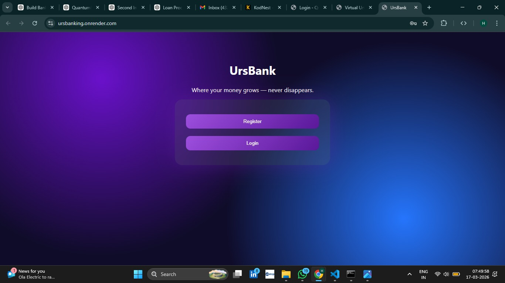
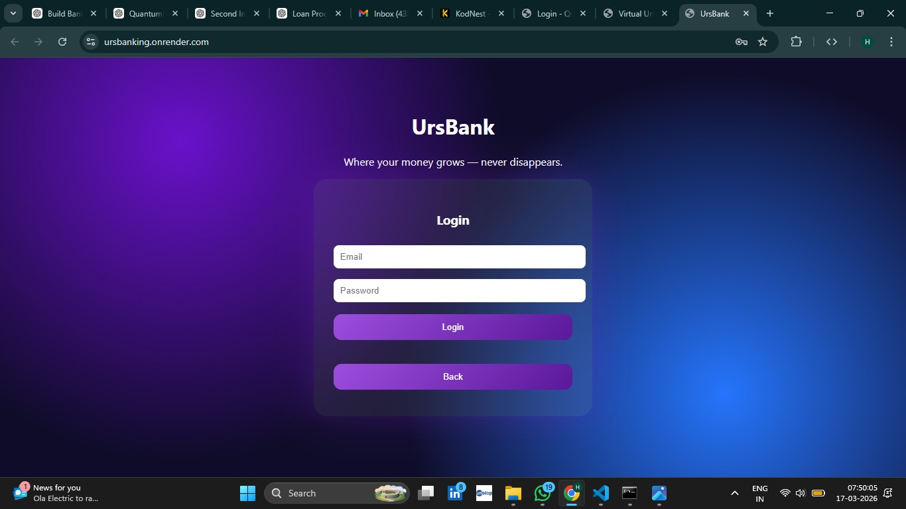
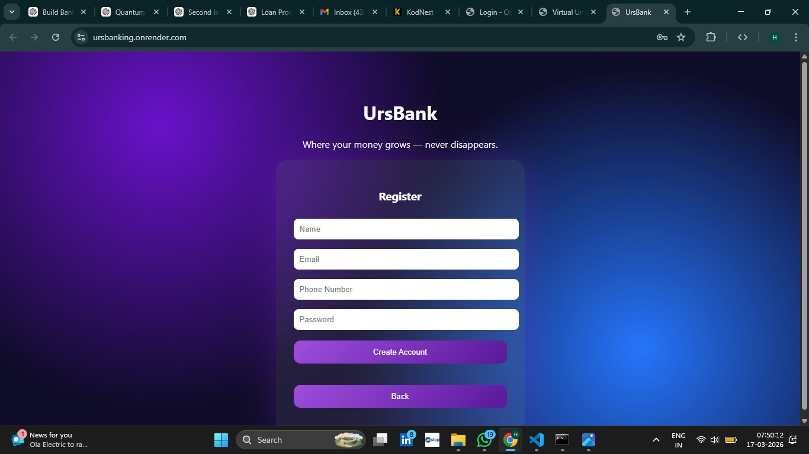
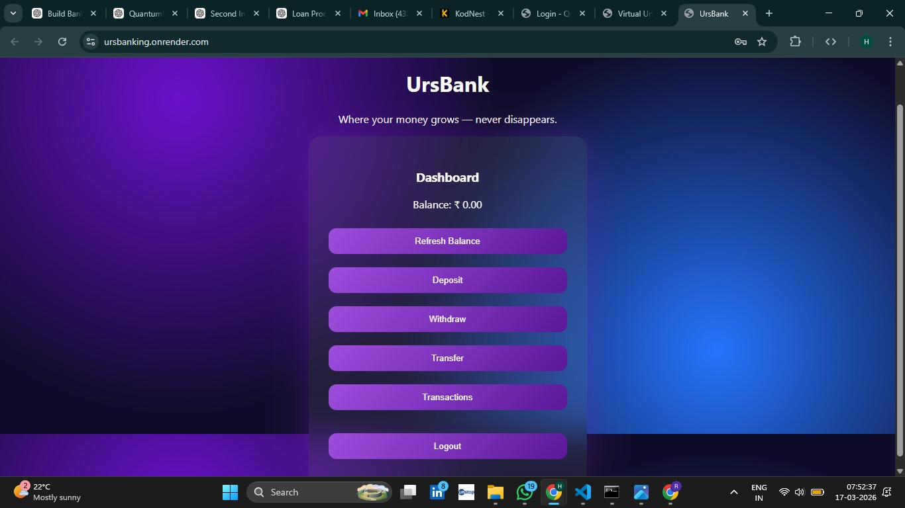
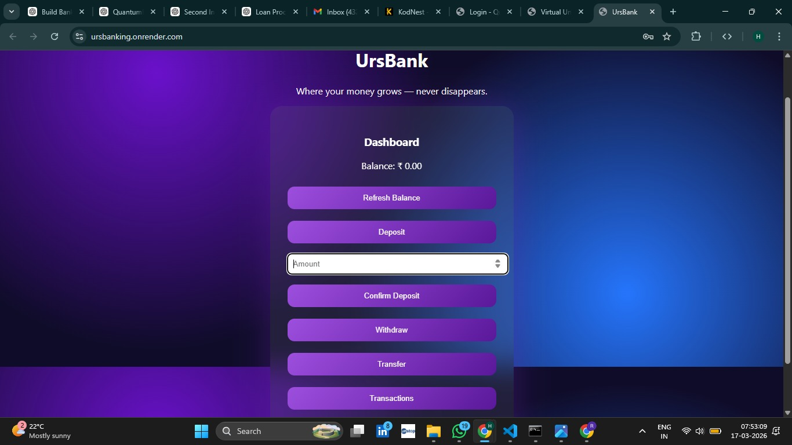
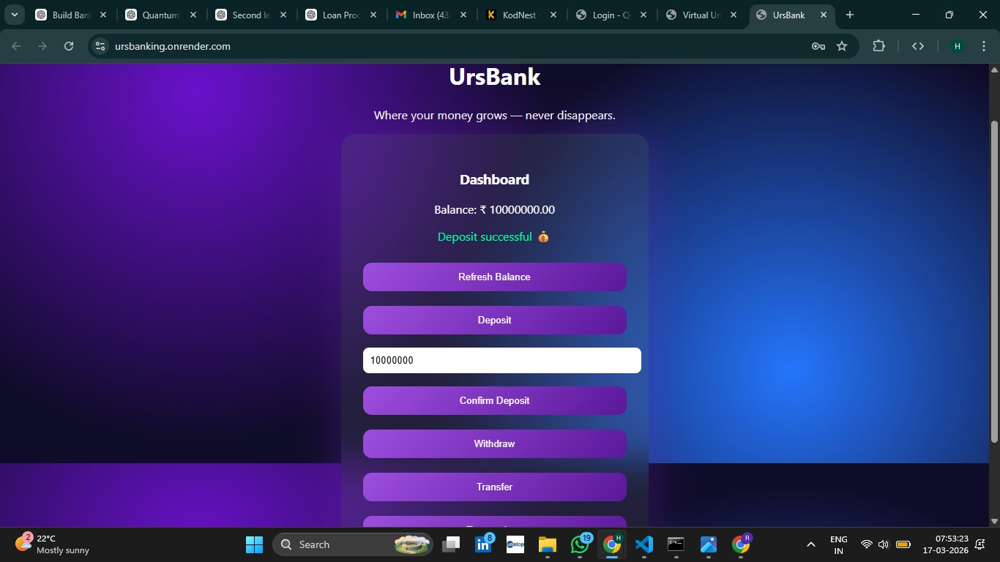
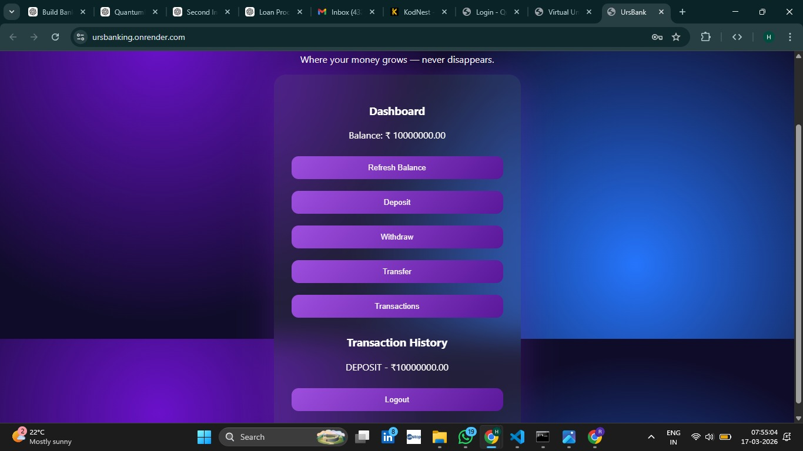
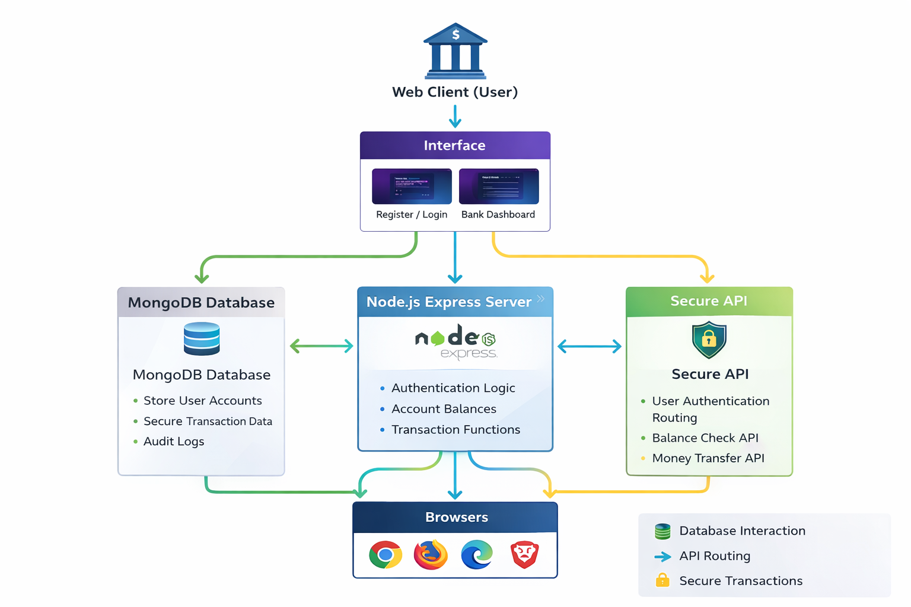

# UrsBank – Mini Banking System

> A secure web-based banking application designed to perform essential financial operations such as account creation, authentication, deposits, withdrawals, fund transfers, and transaction tracking.

UrsBank is a full-stack web application that simulates real-world banking functionalities using modern backend and frontend technologies. The system ensures secure user authentication and enables users to perform financial operations with real-time balance updates.

This project demonstrates the integration of backend systems, database management, and frontend interfaces to build a functional digital banking platform.

---

## Important Note

This repository contains the core components and representative implementation of the UrsBank system.

Some development configurations, local testing environments, and intermediate iterations are not included in this public repository.

Only the necessary files required to demonstrate the functionality and system design of the project are provided.

---

## Project Overview

Banking systems require secure handling of user data and financial transactions.

UrsBank provides a simplified solution by enabling users to:

- Register a new account  
- Log into the system  
- View account balance  
- Deposit money  
- Withdraw funds  
- Transfer money  
- View transaction history  

The system integrates backend logic, database storage, and frontend UI to simulate a complete banking workflow.

---

## Problem Statement

Traditional banking systems require complex infrastructure to securely manage financial transactions and user data.

UrsBank addresses this challenge by:

- Implementing secure user authentication  
- Managing account balances  
- Processing transactions efficiently  
- Maintaining transaction history  

This demonstrates how a simplified banking system can be developed using modern web technologies.

---

## Live Website

Live Application:

https://ursbanking.onrender.com/

---

## High-Level System Architecture

    User interacts with Web Interface
            ↓
    Authentication System (Login/Register)
            ↓
    Backend Server (Node.js + Express)
            ↓
    API Routes (Deposit, Withdraw, Transfer)
            ↓
    MongoDB Database
            ↓
    Transaction Processing & Storage
            ↓
    Updated Balance & Response to User

---

## Interface

  

---

## Login Page

  

---

## Registration Page

  

---

## Dashboard

  

---

## Deposit Process

### Step 1 – Enter Amount

  

### Step 2 – Deposit Successful

  

---

## Transaction History

  

---

## System Architecture

  

---

## Working Process

1. User registers a new account  
2. User logs into the system  
3. Authentication verifies credentials  
4. User accesses dashboard  
5. User performs deposit, withdraw, or transfer  
6. Transactions are processed and stored  
7. Updated balance is displayed  
8. Transaction history is maintained  

---

## Technologies Used

- Node.js  
- Express.js  
- MongoDB  
- HTML  
- CSS  
- JavaScript  

---

## Results

UrsBank successfully demonstrates a functional banking system with secure authentication and transaction handling.

The platform provides:

- Real-time balance updates  
- Secure transaction processing  
- User-friendly interface  
- Transaction history tracking  

---

## Repository Structure

    minibankingapplication/
    │
    ├── assets/
    │   ├── interface.jpeg
    │   ├── login_page.jpeg
    │   ├── registration_page.jpeg
    │   ├── dashboard.jpeg
    │   ├── deposit_input.jpeg
    │   ├── deposit_success.jpeg
    │   ├── transactions.jpeg
    │   └── architecture.png
    │
    ├── public/
    ├── routes/
    │
    ├── db.js
    ├── server.js
    ├── index.html
    ├── style.css
    ├── script.js
    │
    └── README.md

---

## Author

HARSHITHA M V

AI & ML Engineering Student  

Research Interests:
- Artificial Intelligence  
- Machine Learning  
- Web-Based Systems  
- Backend Development  
- Database Systems  
